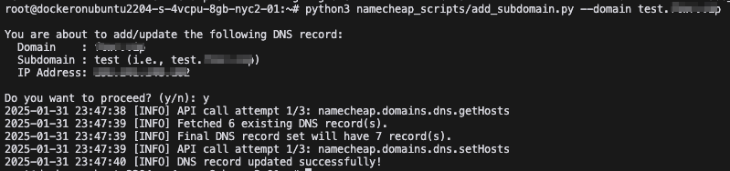
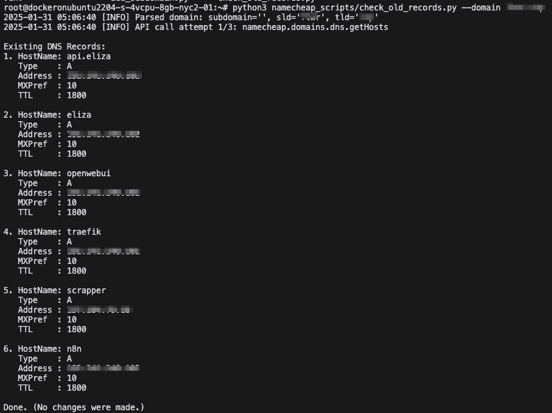

# Namecheap Scripts

A collection of Python scripts to manage DNS records through the Namecheap API. 
These scripts allow you to:

- Add or update a subdomain A record.
- Check or list existing DNS records for a particular domain.

Learn more about Namecheap's DNS API here:
https://www.namecheap.com/support/api/

## Getting Started

1. Clone this repo to your local machine.
2. Create a `.env` file (or copy from `.env.example`) with your Namecheap API 
   credentials and configuration.
3. Install dependencies:    ```
   pip install -r requirements.txt   ```
4. Run the scripts:
   ```
   python add_subdomain.py --domain dev.example.com --ip 8.8.8.8
   ```
   ```
   python check_old_records.py --domain example.com
   ```

## Screenshots

Below is a screenshot from the "add_subdomain.py" script in action:



Below is a screenshot from the "check_old_records.py" script in action:



## Royalty-Based License

This project is under a custom royalty-based license. If you intend to use 
these scripts commercially, please review the [LICENSE](LICENSE) file and 
contact the copyright holder.

## Contributing

Pull requests are welcome with prior discussion. For significant changes, 
please open an issue first to discuss your proposed modifications.

## Contact

For questions, issues, or commercial licensing discussions, reach out to:
iam@nolanhu.com
